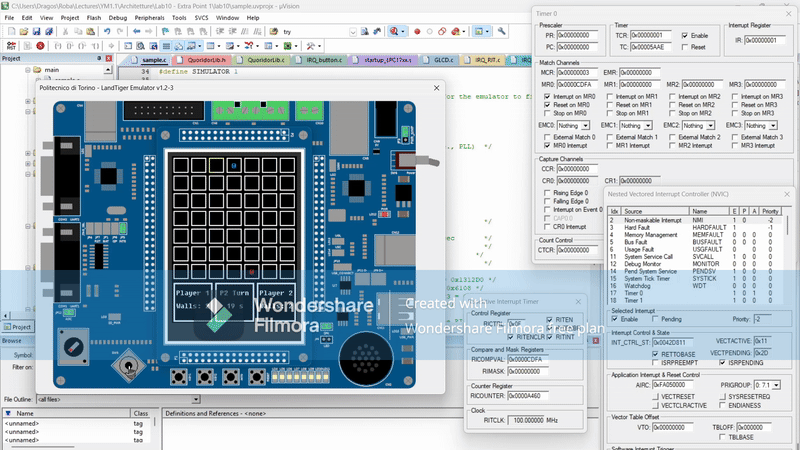

Implementation of the board game Quoridor on an ARM-based board, called LandTiger. The project was an extra assignment for the 2023/2024 Architetture dei sistemi di elaborazione course at PoliTO. All the copyright for the already implemented code can be found in the files. The project can be better explored using Keil muVision.  

## Demo Video
  

*Note: The emulator is quite slow, so what would look like normal game-board updates or vfx on the actual board, in the emulator would look extremely slow unless the video is sped up.*